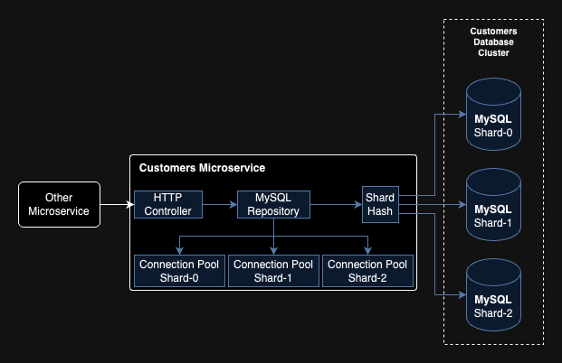

## Introduction

This project is a demonstration of an application with physical shards of the database, using Go. Sharding helps to distribute data across multiple databases to improve performance and scalability. In this example, customer data is distributed across three shards.



## Running the Application

1. **Clone the repository:**
```bash
git clone https://github.com/margato/go-mysql-sharding.git
cd go-sharding
```
2. **Navigate to the infra folder and start the Docker containers:**

```bash
cd infra
docker-compose up -d
```
3. **Set up the environment variables:**

Ensure that your MySQL instances are running and set the environment variables accordingly, in the app path:

```bash
cd ../app
export SHARD_0_DSN="root:@tcp(localhost:3306)/customers?charset=utf8mb4&parseTime=True&loc=Local"
export SHARD_1_DSN="root:@tcp(localhost:3307)/customers?charset=utf8mb4&parseTime=True&loc=Local"
export SHARD_2_DSN="root:@tcp(localhost:3308)/customers?charset=utf8mb4&parseTime=True&loc=Local"
```

4. **Run the application:**

```bash
go build
./go-mysql-sharding
```
## Testing the Application
### Create a New Customer
To create a new customer, use the following curl command:
```bash
curl -i -X POST http://localhost:8080/customers \
  -H "Content-Type: application/json" \
  -d '{"name": "John Doe"}'
```

### Get Customer by ID
To get a customer by their ID, use the following curl command, replacing <REPLACE ID> with the actual customer ID:

```bash
curl -i http://localhost:8080/customers/<REPLACE ID>
```

## Results

We can bulk insert 1,000 customers with the code below:
```bash 
for i in {1..1000}
do
  curl -i -X POST http://localhost:8080/customers \
    -H "Content-Type: application/json" \
    -d "{\"name\": \"John Doe $i\"}"
  sleep 0.1 
done
```

After running the script, we can see the following distribution:

| Shard | Customers |
|-------|-----------|
| 0     | 342       |
| 1     | 327       |
| 2     | 331       |

Obs.: This results vary in each execution, given hashes are random.